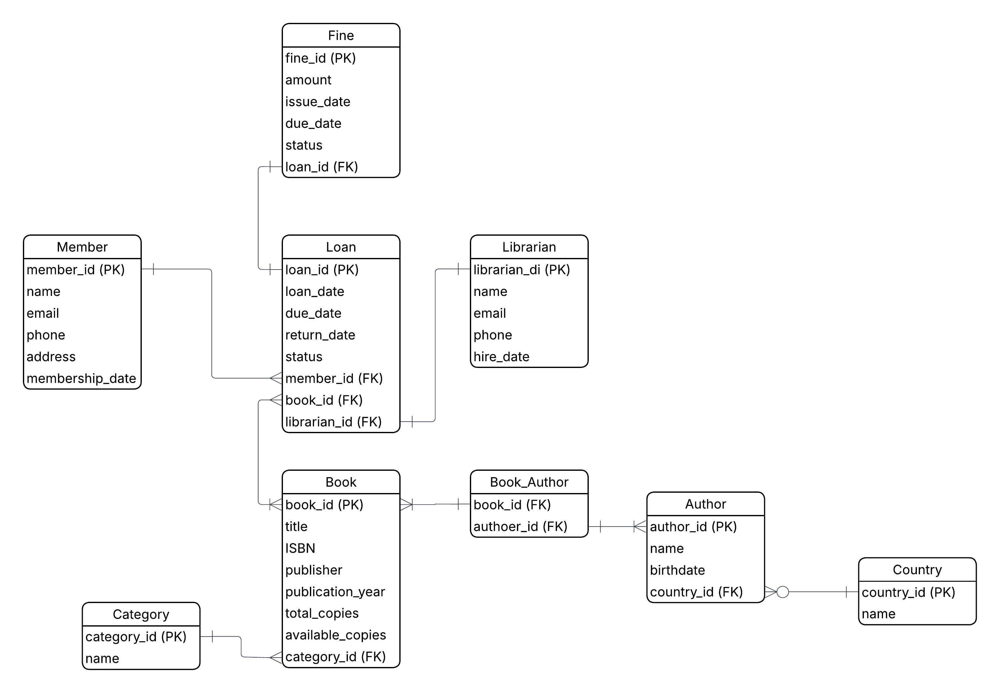

# 📚 Library Management System (ERD + SQL)

This project implements a **Library Management System** with a clean ERD and SQL scripts for table creation, sample data population, and example queries.

---

## 🏗 Features

- **Books** (with categories, multiple authors, availability tracking)
- **Members** (borrowers)
- **Librarians** (who issue/manage loans)
- **Loans** (book borrowing records)
- **Fines** (for overdue returns)
- **Authors & Countries** (author details and nationality)
- **Categories** (book classification)

---

## 📊 ERD

---

## 📂 Files

- `sql/1_create.sql` → SQL schema creation  
- `sql/2_populate.sql` → Insert sample data  
- `sql/3_queries.sql` → Example queries  

---

